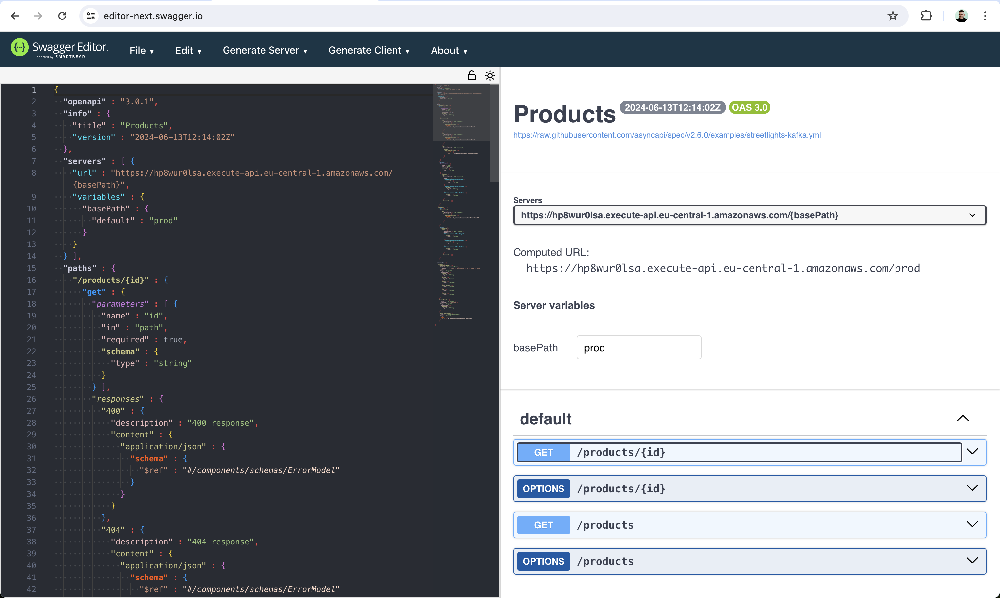

# Overview

Import Service is responsible for importing products via CSV file upload to a S3 presigned url.

## NPM scripts

- `build` - Builds Lambdas and AWS CDK application
- `cdk` - Builds/runs AWS CDK project (no need to call manually, it's used in `cdk.json` config file);

- `cdk:diff` - Runs AWS CDK diff command to illustrate how local template is different to a deployed one (in order to use a user's profile the script needs to be run as `npm run cdk:diff -- --profile={profile_name}`)

- `cdk:deploy` - Runs AWS CDK deploy command to deploy stack (in order to use a user's profile the script needs to be run as `npm run cdk:deploy -- --profile={profile_name}`)

- `cdk:destroy` - Runs AWS CDK destroy command to destroy previously deployed stack (in order to use a user's profile the script needs to be run as `npm run cdk:destroy -- --profile={profile_name}`)

- `test` - Runs unit tests

## Deployment

In order to deploy application stack with AWS CDK one needs to run the following command:
`npm run cdk:deploy` (in order to use a user's profile the script needs to be run as `npm run cdk:deploy -- --profile={profile_name}`)

## Import Service API

Product Service API is available at https://sjova0c3h3.execute-api.eu-central-1.amazonaws.com/prod:

1. To get presigned url for file upload use GET https://sjova0c3h3.execute-api.eu-central-1.amazonaws.com/prod/import?name={filename}, where {filename} is a valid CSV file name, e.g. `products.csv`;
2. To upload CSV file with products use PUT {presigned_url}, where {presegned_url} is returned in p.1 (performed by FE application).

### OpenAPI Documentation

Use [Import-prod-oas30.json](./docs/Import-prod-oas30.json) file (exported from `prod` stage of AWS API Gateway) and import it at https://editor-next.swagger.io/ (`File` -> `Import File` in the menu, see example usage on the screenshot below)

### Postman

Use [import_service.postman_collection.json](./postman/import_service.postman_collection.json) collection to test REST API endpoints with [Postman](https://www.postman.com)
