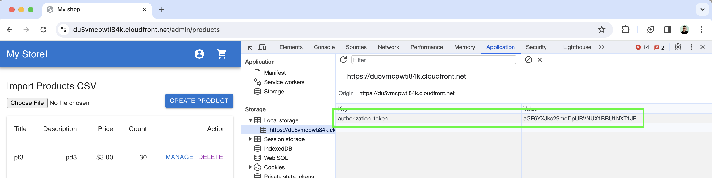
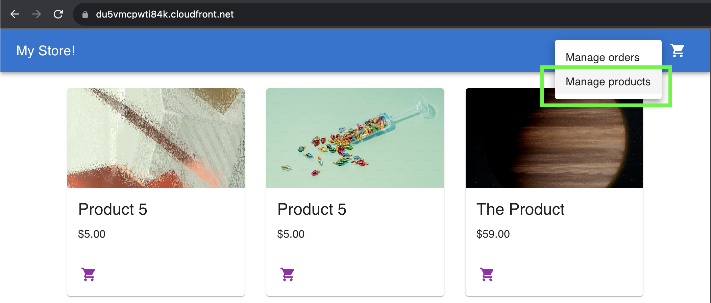
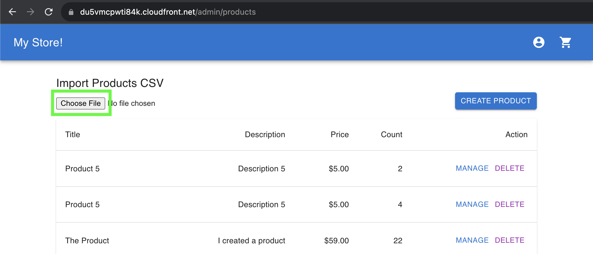
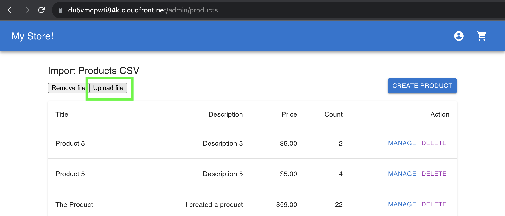
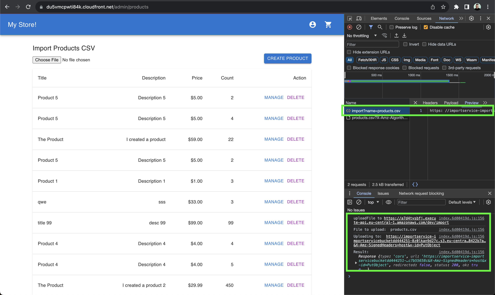
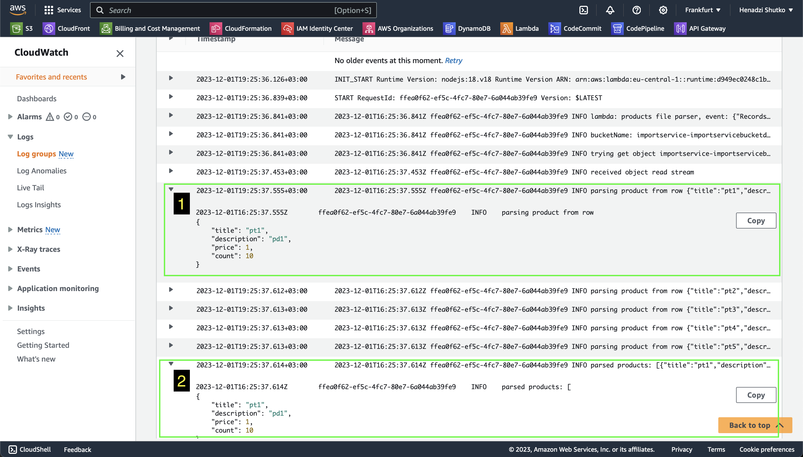

# Overview

Product Service is responsible for retrieving list of products or a product by id (mock data is used for now).

## NPM scripts

- `build` - Builds Lambdas and AWS CDK application
  
- `cdk` - Builds/runs AWS CDK project (no need to call manually, it's used in `cdk.json` config file);

- `cdk:diff` - Runs AWS CDK diff command to illustrate how local template is different to a deployed one (in order to use a user's profile the script needs to be run as `npm run cdk:diff -- --profile={profile_name}`)

- `cdk:deploy` - Runs AWS CDK deploy command to deploy stack (in order to use a user's profile the script needs to be run as `npm run cdk:deploy -- --profile={profile_name}`)

- `cdk:destroy` - Runs AWS CDK destroy command to destroy previously deployed stack (in order to use a user's profile the script needs to be run as `npm run cdk:destroy -- --profile={profile_name}`)

- `test` - Runs Lambdas and CDK tests

## Deployment

In order to deploy application stack with AWS CDK one needs to run the following command:
`npm run cdk:deploy` (in order to use a user's profile the script needs to be run as `npm run cdk:deploy -- --profile={profile_name}`)

## Import Service API

### Enpoints

1. To get signed url for products CSV file upload use https://a7d4tysbfj.execute-api.eu-central-1.amazonaws.com/dev/import?name={filename} (GET), where `{filename}` is a CSV file name to be uploaded to S3

### Products File Format

The following format is required (example file can be found at [products.csv](./tests/data/products.csv)):
1. File extension must be `.csv`
2. Delimiter is `,` (comma)
3. 1st line must contain columns `title`, `description`, `price`, `count`

### Upload Products File from FE Application

#### Prerequisites
Add `authorization_token` `aGF6YXJkc29mdDpURVNUX1BBU1NXT1JE` to local storage e.g. via Chrome Dev Tools by typing the following command in the console:
```
localStorage.setItem("authorization_token", "aGF6YXJkc29mdDpURVNUX1BBU1NXT1JE")
```


1. Select `Manage Products` menu; 



2. Click `Choose File` button;



3. Click `Upload file` button;



4. You should see `/import` endpoint request in dev tools console:



5. Once uploaded another Lambda function is triggered that will parse uploaded file and move from `uploaded` to `parsed` folder once parsing is finished.


   
### Api Testing

One can use Postman to test Import Service authorization using [collection](./postman/RS_School-AWS_Developer.postman_collection.json):
1. `Import Products (401)` does not send `Authorization` header thus resulting in HTTP 401 Unauthorized status code;
2. `Import Products (403)` sends `Authorization` header but contains incorrect password thus resulting in HTTP 403 Forbidden status code;
3. `Import Products (200)` send `Authorization` header containing valid credentials thus resulting in HTTP 200 OK status code.

### Swagger Documentation

Use [openapi.yaml](./openapi.yaml) file (exported from `dev` stage of AWS API Gateway) and import it at https://editor-next.swagger.io/
