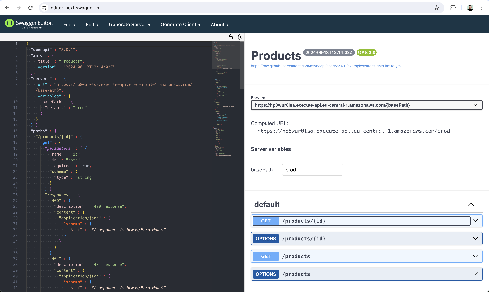

# Overview

Product Service is responsible for retrieving list of products or a product by id.

## NPM scripts

- `build` - Builds Lambdas and AWS CDK application
- `cdk` - Builds/runs AWS CDK project (no need to call manually, it's used in `cdk.json` config file);

- `cdk:diff` - Runs AWS CDK diff command to illustrate how local template is different to a deployed one (in order to use a user's profile the script needs to be run as `npm run cdk:diff -- --profile={profile_name}`)

- `cdk:deploy` - Runs AWS CDK deploy command to deploy stack (in order to use a user's profile the script needs to be run as `npm run cdk:deploy -- --profile={profile_name}`)

- `cdk:destroy` - Runs AWS CDK destroy command to destroy previously deployed stack (in order to use a user's profile the script needs to be run as `npm run cdk:destroy -- --profile={profile_name}`)

- `test` - Runs unit tests

## Deployment

In order to deploy application stack with AWS CDK one needs to run the following command:
`npm run cdk:deploy` (in order to use a user's profile the script needs to be run as `npm run cdk:deploy -- --profile={profile_name}`)

## Product Service API

Product Service API is available at https://hp8wur0lsa.execute-api.eu-central-1.amazonaws.com/prod:

1. To get full list of products use https://hp8wur0lsa.execute-api.eu-central-1.amazonaws.com/prod/products
2. To get one product by id use https://hp8wur0lsa.execute-api.eu-central-1.amazonaws.com/prod/products/{id}, where {id} is id of one of the items got in p.1

N.B. REST API returns mock data stored in [products.json](src/data/products.json)
   
### Swagger Documentation

Use [Products-prod-oas30.json](./docs/Products-prod-oas30.json) file (exported from `prod` stage of AWS API Gateway) and import it at https://editor-next.swagger.io/ (`File` -> `Import File` in the menu, see example usage on the screenshot below)

### Postman

Use [postman_collection.json](./postman/postman_collection.json) collection to test REST API endpoints with [Postman](https://www.postman.com)
