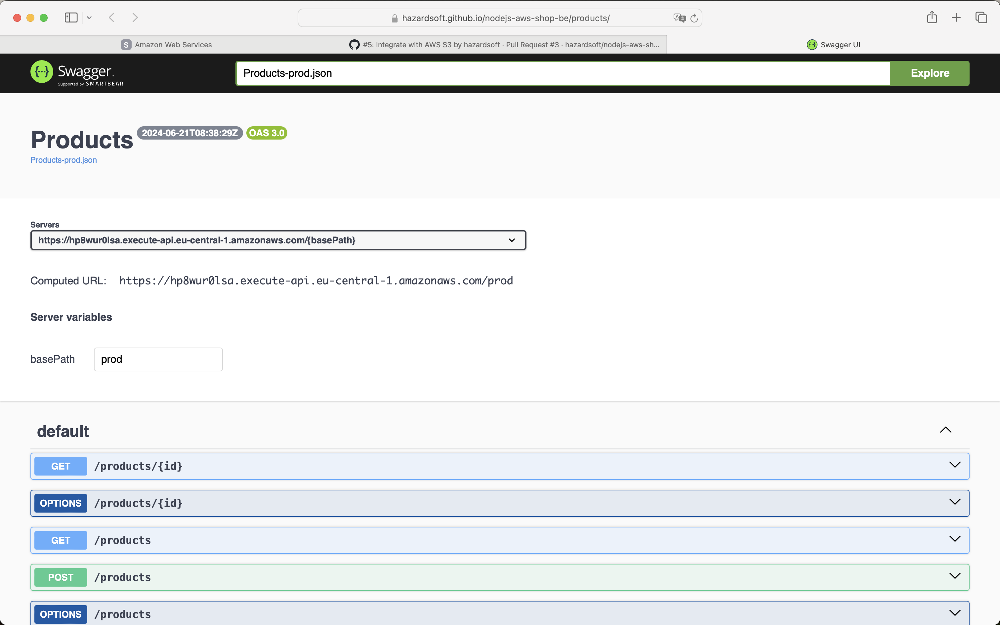

# Overview

Product Service is responsible for retrieving list of products or a product by id.

## NPM scripts

- `build` - Builds Lambdas and AWS CDK application
- `cdk` - Builds/runs AWS CDK project (no need to call manually, it's used in `cdk.json` config file);

- `cdk:diff` - Runs AWS CDK diff command to illustrate how local template is different to a deployed one (in order to use a user's profile the script needs to be run as `npm run cdk:diff -- --profile={profile_name}`)

- `cdk:deploy` - Runs AWS CDK deploy command to deploy stack (in order to use a user's profile the script needs to be run as `npm run cdk:deploy -- --profile={profile_name}`)

- `cdk:destroy` - Runs AWS CDK destroy command to destroy previously deployed stack (in order to use a user's profile the script needs to be run as `npm run cdk:destroy -- --profile={profile_name}`)

- `test` - Runs tests:

  - `test:unit` - Runs unit tests
  - `test:integration` - Runs integration tests (DynamoDB local run via Docker)

- `dynamodb` - Populates DynamoDB with initial data (data for `Products`/`Stocks` tables is taken from [products.json](src/data/products.json))
- `docker:up` - Starts DynamoDB local service (see [docker-compose.yml](./docker-compose.yml) for implementation details)
- `docker:down` - Stops DynamoDB local service

## Environment

### Populate DynamoDB

NPM script `dynamodb:populate` uses `.env` file in order to access DynamoDB (required for _**remote**_ access only).
Copy-paste `.env.example` file, rename it to `.env` and fill with values of `AWS_ACCESS_KEY_ID` and `AWS_SECRET_ACCESS_KEY`.
Credentials can be created with the following steps:

1. Log into AWS Console;
2. Click on a profile name in the top right corner of the screen and select `Security credentials`;
3. Scroll down to `Access keys` section;
4. Click on `Create access key` button;
5. After creation copy values of `Access key` and `Secret access key`;
6. Once remote DynamoDB is populated delete previously created access key.

### Products Batch Processing

The following env vars are used in AWS CDK stack to configure email notifications sent once processing of products of uploaded CSV file is complete:
1. `TOPIC_SUBSCRIPTION_EMAIL` - email to send all notifications to;
2. `TOPIC_SUBSCRIPTION_EMAIL_LOW_STOCK` - another email to send notifications if a batch contains a product with zero stock.

## Deployment

In order to deploy application stack with AWS CDK one needs to run the following command:
`npm run cdk:deploy` (in order to use a user's profile the script needs to be run as `npm run cdk:deploy -- --profile={profile_name}`)

## Product Service API

Product Service API is available at https://hp8wur0lsa.execute-api.eu-central-1.amazonaws.com/prod:

1. To get full list of products use https://hp8wur0lsa.execute-api.eu-central-1.amazonaws.com/prod/products
2. To get one product by id use https://hp8wur0lsa.execute-api.eu-central-1.amazonaws.com/prod/products/{id}, where {id} is id of one of the items got in p.1

N.B. Previously used mock data from [products.json](src/data/products.json) is replaced with read/write operations from/to AWS DynamoDB

### OpenAPI Documentation

Use [Products-prod-oas30.json](./docs/Products-prod.json) file (exported from `prod` stage of AWS API Gateway) and import it at https://editor-next.swagger.io/ (`File` -> `Import File` in the menu, see example usage on the screenshot below)

### Postman

Use [postman_collection.json](./postman/postman_collection.json) collection to test REST API endpoints with [Postman](https://www.postman.com)
