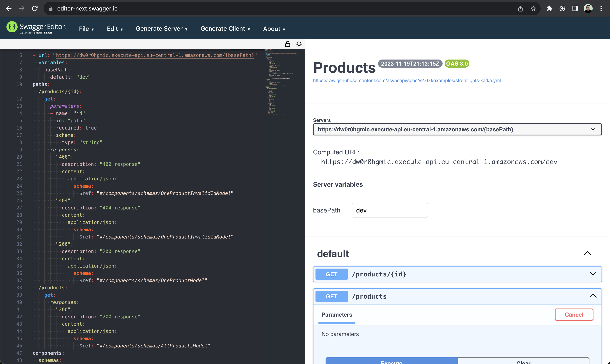

# Overview

Product Service is responsible for retrieving list of products or a product by id (mock data is used for now).

## NPM scripts

* `cdk` - Builds/runs AWS CDK project (no need to call manually, it's used in `cdk.json` config file);

* `cdk:diff` - Runs AWS CDK diff command to illustrate how local template is different to a deployed one (in order to use a user's profile the script needs to be run as `npm run cdk:diff -- --profile={profile_name}`)

* `cdk:deploy` - Runs AWS CDK deploy command to deploy stack (in order to use a user's profile the script needs to be run as `npm run cdk:deploy -- --profile={profile_name}`)

* `cdk:destroy` - Runs AWS CDK destroy command to destroy previously deployed stack (in order to use a user's profile the script needs to be run as `npm run cdk:destroy -- --profile={profile_name}`)

## Deployment

In order to deploy application stack with AWS CDK one needs to run the following command:
`npm run cdk:deploy` (in order to use a user's profile the script needs to be run as `npm run cdk:deploy -- --profile={profile_name}`)

## Product Service API

Product Service API is available at https://dw0r0hgmic.execute-api.eu-central-1.amazonaws.com/dev:
1. To get full list of products use https://dw0r0hgmic.execute-api.eu-central-1.amazonaws.com/dev/products
2. To get one product by id use https://dw0r0hgmic.execute-api.eu-central-1.amazonaws.com/dev/products/{id}, where {id} is 1..4 (if out-of-range id is used 404 error will be returned)

### Swagger Documentation

Use [openapi.yaml](./openapi.yaml) file (exported from `dev` stage of AWS API Gateway) and import it at https://editor-next.swagger.io/ (`File` -> `Import File` in the menu, see example usage on the screenshot below)
